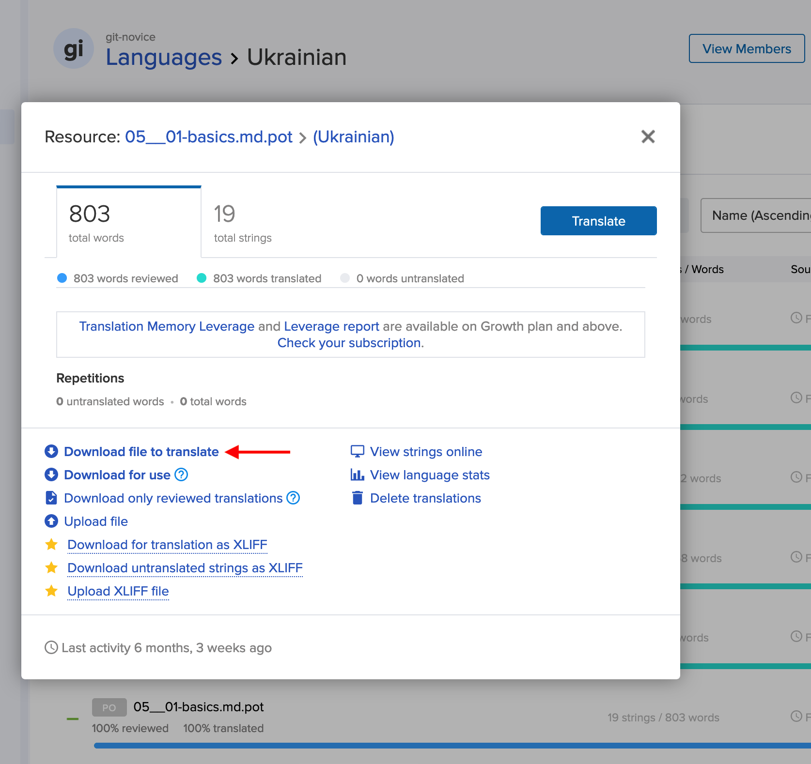

# carp-trans-tools

Repository with tools for helping to translate [The Carpentries](https://carpentries.org) lessons

## Scripts

### [`make_trans_mem.R`](make_trans_mem.R)

Transifex doesn't allow exporting translation memory without a paid account, so this script does it using PO files that we can download from a standard project.

You will need to download the PO file for **each file** in the Transifex project by selecting the file, then "Download file to translate":

Save all of these to `data/po`, then run `make_trans_mem.R`.

The final translation memory (a single CSV file) will be written to `results/combined.csv`.

### [`csv_to_po_sandpaper.R`](csv_to_po_sandpaper.R)

This is a helper script to make it easier for translators to provide translations for [Sandpaper variables](https://carpentries.github.io/sandpaper/articles/translations.html#list-of-translation-variables).

Instead of editing a PO file, the translator can send the maintainer a CSV file of translations, then the maintainer can convert it to PO.

## Dependencies

- R
- Docker